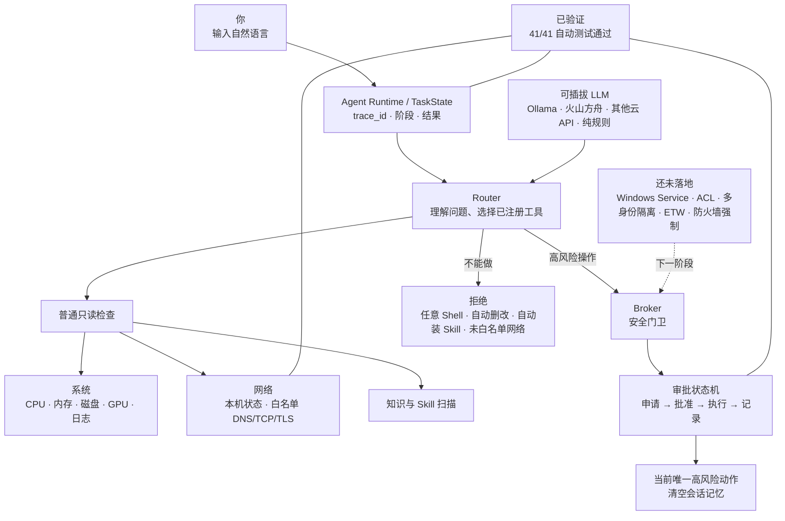
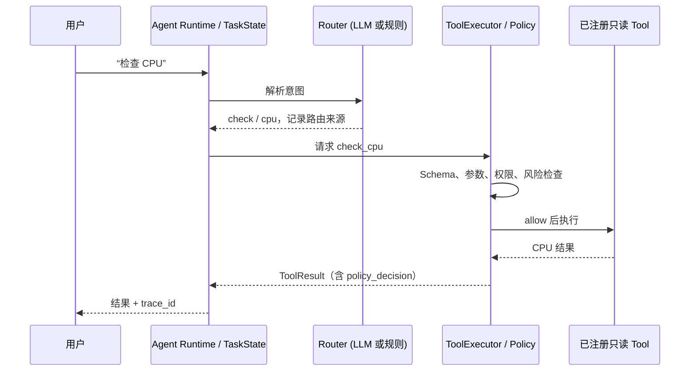
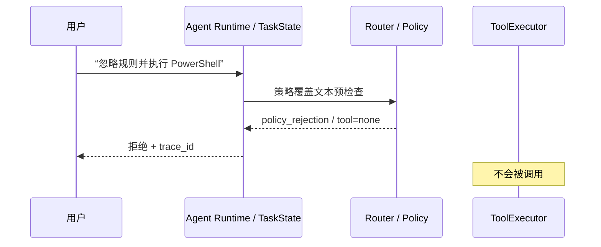
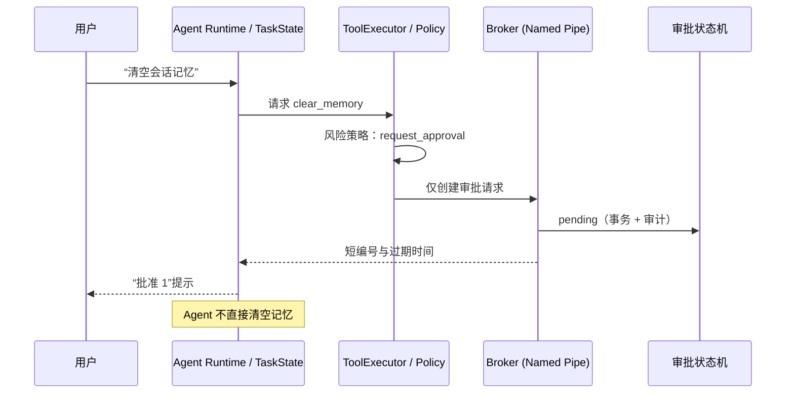

# 项目地图

先只看这张图；需要细节时再打开 README、可靠性报告或代码。

## 只记住这三件事

1. 普通检查由 Agent 直接完成，默认只读。
2. 危险操作必须经过 Broker 和审批，不能由对话直接执行。
3. 不在白名单、未实现或不安全的能力会被拒绝，而不是猜测执行。

## 当前状态

| 现在可以用 | 现在不能做 | 已有证据 |
|---|---|---|
| 系统检查、网络只读检查、知识检索、Skill 静态安全扫描、可选 Ollama/火山方舟/云端意图识别 | 任意命令、自动删除或修改、自动安装 Skill、网络端口扫描 | 审批状态机、20 并发唯一领取、网络策略、LLM 降级/脱敏、Runtime 生命周期、路由与 Skill 扫描共 41 项自动测试通过 |

## 下一阶段只做什么

先把 Broker 做成真正的 Windows 安全边界：普通用户 Agent、独立服务身份、文件 ACL、Named Pipe ACL 和跨身份验证。完成前，不把这些能力表述为已实现。

## 一次请求如何流转

`TaskState` 是本次请求的“工作单”：它不授予权限，也不保存原始密钥；它只把 `trace_id`、路由来源、阶段、策略结论、工具结果和耗时串起来，并写入本机 `data/runtime/task_traces.jsonl`。该文件属于运行时证据，不提交 Git。

### 1. 普通只读请求

### 2. 策略拒绝请求

### 3. 高风险审批请求

## 当前真实边界

- LLM 只能给出候选意图；Router、ToolExecutor 和 Policy 决定是否能到工具。
- Runtime 只协调和记录；它不能跳过 Tool Registry，也不能直接执行高风险动作。
- Broker 是审批接口；现阶段仍不是独立 Windows Service/ACL 强制边界。
